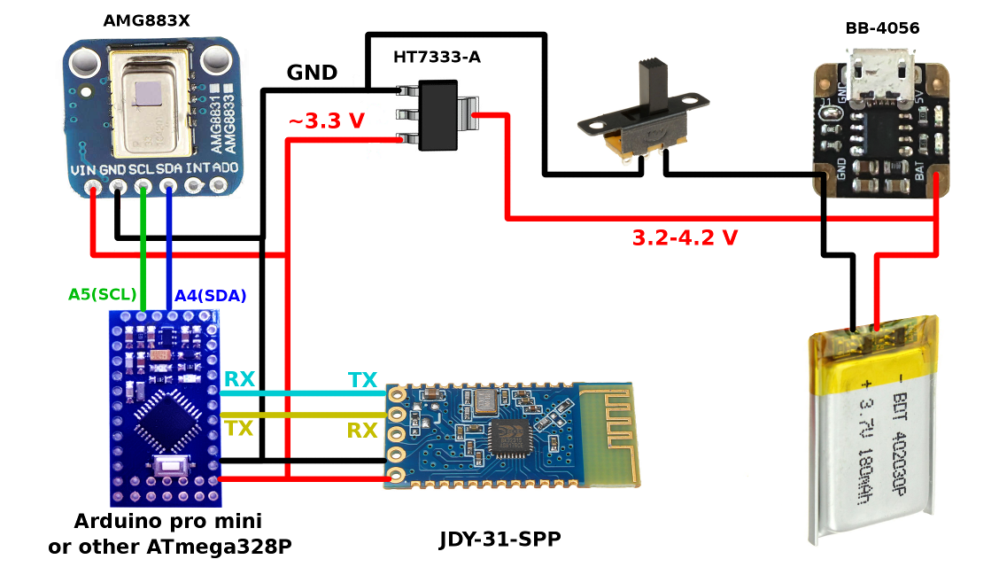
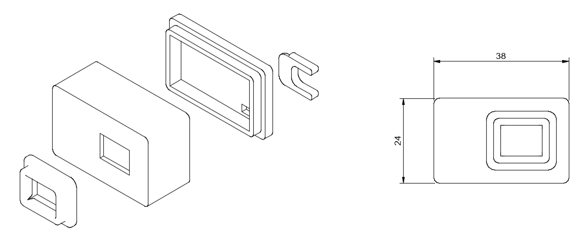
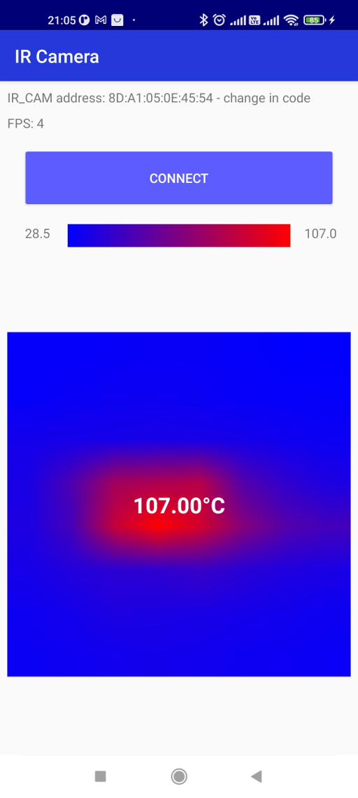
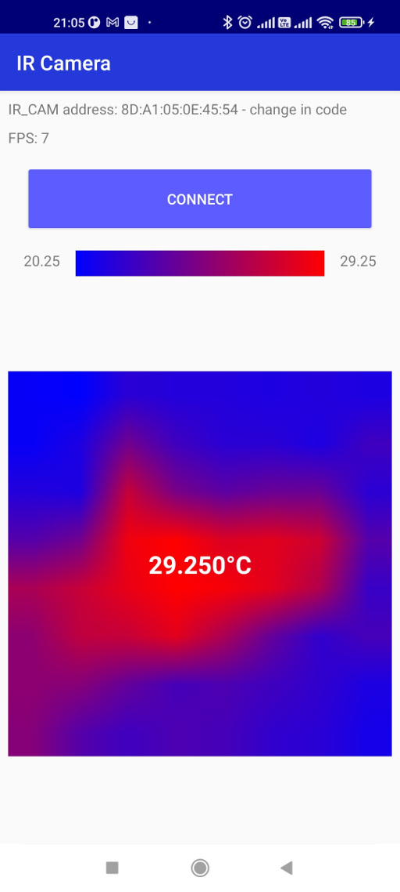

# Bluetooth infrared camera

## Camera electrical scheme

Just a 19ma in active mode

## Models for 3d printing
Models in folder [models_for_3d_printing/](models_for_3d_printing/)

## Arduino sketch
Sketch folder [ir_cam_arduino/](ir_cam_arduino/)

## Android app
Android studio project folder [ir_cam_android/](ir_cam_android/)
For your device change bluetooth address in the file [ir_cam_android/app/src/main/java/ru/cubos/ir_cam_android/IRView.java/](ir_cam_android/app/src/main/java/ru/cubos/ir_cam_android/IRView.java/) 

